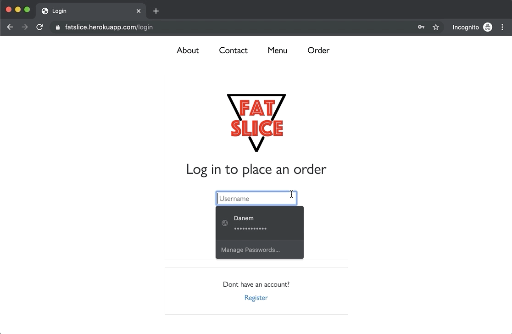
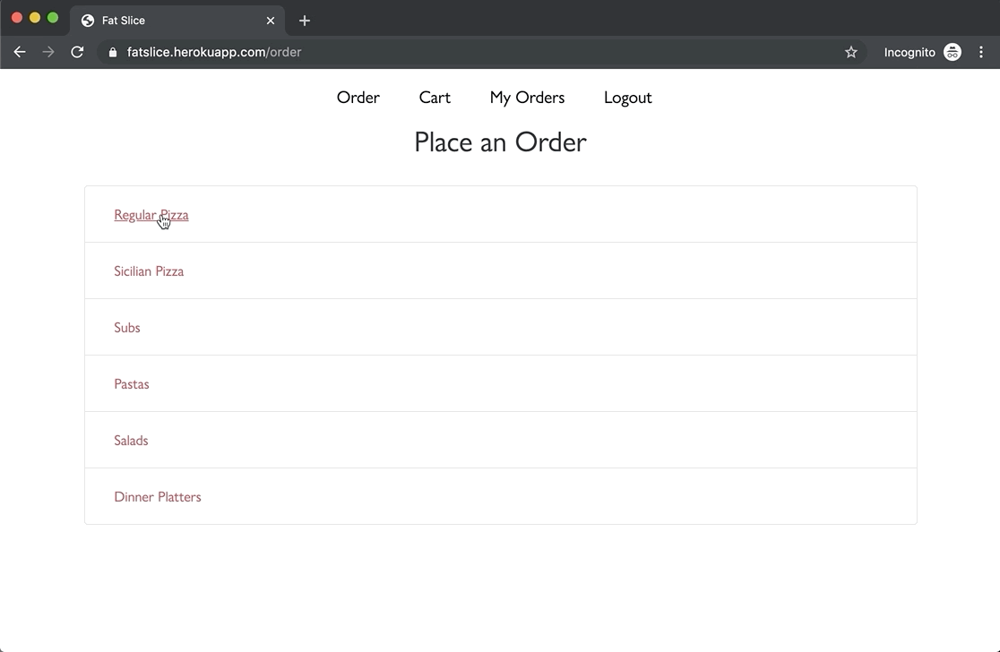
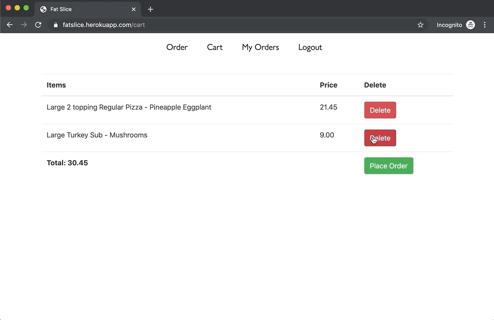

# Fatslice

A fullstack food ordering system with administrator controls.

# Technologies Used

* JavaScript
* Python
* Django
* CSS 3
* HTML 5
* Heroku

# Live Demo

Try it live at: https://fatslice.herokuapp.com

# Features

* User can view available items
* User can sign up, login, and logout
* User can select a number of toppings depending on the type of pizza/item selected
* User can place items in their cart
* User can see the order total for the items in the cart
* User can remove items from their cart
* User can confirm their order
* User can see the status of their order
* Admins can add items to the database
* Admins can see users orders
* Admins can confirm item is out for delivery

# Preview







# Development

#### System Requirements

* Python 3
* pip
* virtualenv

#### Getting Started

1. Clone the repository.

    ```
    git clone https://github.com/danemaison/fatslice.git
    cd fatslice
    ```

1. Create and activate a new virtual environment

    ```
    python3 -m venv env
    source env/bin/activate
    ```

1. Install the requirements with pip

    ```
    pip install -r requirements.txt
    ```

1. Set the environment variable `SECRET_KEY`

    You can use any arbitrary string value, something like `secret` will do.

    Mac
    ```
    export FLASK_APP=application.py
    ```

    Windows
    ```
    set FLASK_APP=application.py
    ```
1. Run the command `python3 manage.py migrate`

1. Start the application
  `python3 manage.py runserver`

1. Navigate to `http://127.0.0.1:8000` in your browser
